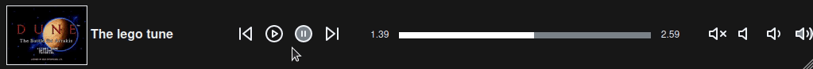

# React Tunes Player
[](https://www.npmjs.com/package/react-tunes-player) 
[](https://travis-ci.org/zulucoda/react-tunes-player) 
[](https://coveralls.io/github/zulucoda/react-tunes-player?branch=master)

A simple .ogg/.mp3 player. 

[](https://react-tunes-player.mfbproject.co.za/)

## Demo
[Demo - https://react-tunes-player.mfbproject.co.za/](https://react-tunes-player.mfbproject.co.za/)

## Installation

````
npm install --save react-tunes-player
````
or
````
yarn add react-tunes-player
````

## Usage

````javascript
import React from 'react';
import ReactDOM from 'react-dom';
import ReactTunesPlayer from 'react-tunes-player';

const data = [
  {
    tune:
      'https://react-tunes-player.mfbproject.co.za/assets/audio/the_lego_tune.ogg',
    name: 'The lego tune',
    album: 'https://react-tunes-player.mfbproject.co.za/assets/images/dune.jpg',
  },
  {
    tune:
      'https://react-tunes-player.mfbproject.co.za/assets/audio/bensound-funkysuspense.mp3',
    name: 'Funky Suspense',
    album:
      'https://react-tunes-player.mfbproject.co.za/assets/images/funkysuspense.jpg',
  },
];

ReactDOM.render(
  <ReactTunesPlayer tunes={data} />,
  document.querySelector('.app'),
);
````

### Example folder on how to use `react-tunes-player`
[example](example)

### Tune Type

| Name | Type | Description | Example |
| :----| :----| :-----------| :-----------| 
| tune  | string | This is the tune location | `tune: 'https://react-tunes-player.mfbproject.co.za/assets/audio/the_lego_tune.ogg'` |
| name  | string | This is the tune name | `name: 'The lego tune'` |
| album  | string | This is the tune album art location | `album: 'https://react-tunes-player.mfbproject.co.za/assets/images/dune.jpg'` |

Example:
```
// Tune Type
{
     tune: "/assets/audio/the_lego_tune.ogg",
     name: "The lego tune",
     album: "/assets/images/dune.jpg"
}
```

### Available Props

| Prop | Type | Description |
| :------| :-----------| :-----------|
| tunes  | `Array<Tune>` | [Array of Tune Type](#tune-type) |

Example:
```
// tunes
[
 {
     tune: "/assets/audio/the_lego_tune.ogg",
     name: "The lego tune",
     album: "/assets/images/dune.jpg"
 }
]
```

## Music Credits
[Royalty Free Music from Bensound](http://www.bensound.com/)

[Dune: The Battle for Arrakis](https://en.wikipedia.org/wiki/Dune_II)

## License
MIT License.

Copyright (c) 2017 Muzikayise Flynn Buthelezi (zuluCoda).